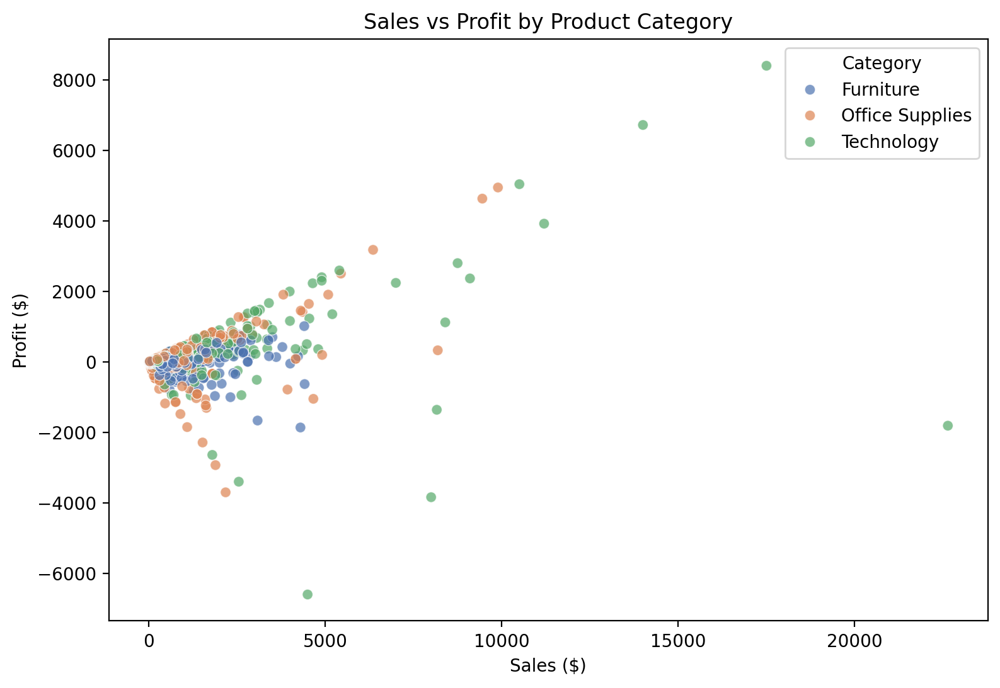
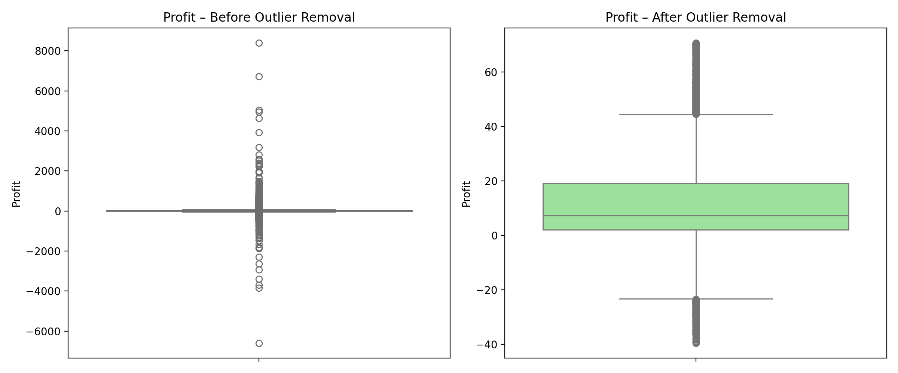
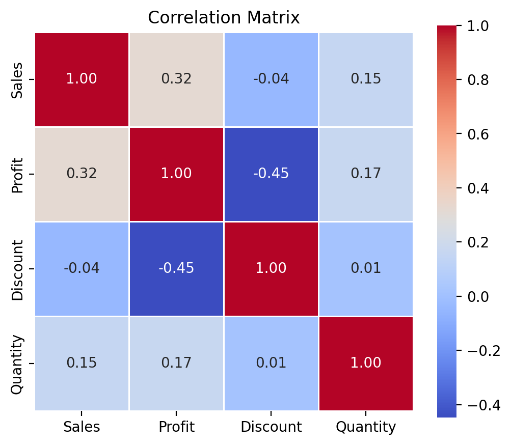

# MSCS 634 – Lab 1  
## **Data Visualization, Preprocessing & Statistical Analysis Using Python**

---

**Student:** Mohit Gokul Murali  
**Course:** Advanced Big Data and Data Mining (MSCS-634-B01)  
**Instructor:** Satish Penmatsa (`s-pen-uc`)  
**Submission Date:** November 02, 2025  
**GitHub Repository:** `https://github.com/yourusername/MSCS_634_Lab_1`

---

## Table of Contents

1. [Project Overview](#project-overview)  
2. [Dataset Description](#dataset-description)  
3. [Methodology & Implementation](#methodology--implementation)  
   - [Step 1: Data Collection](#step-1-data-collection)  
   - [Step 2: Data Visualization](#step-2-data-visualization)  
   - [Step 3: Data Preprocessing](#step-3-data-preprocessing)  
   - [Step 4: Statistical Analysis](#step-4-statistical-analysis)  
4. [Key Findings & Insights](#key-findings--insights)  
5. [Challenges & Design Decisions](#challenges--design-decisions)  
6. [Repository Structure](#repository-structure)  
7. [Required Screenshots (All Included)](#required-screenshots)  
8. [How to Reproduce](#how-to-reproduce)  
9. [Submission Checklist](#submission-checklist)  
10. [References](#references)

---

<a name="project-overview"></a>
## 1. Project Overview

This lab implements a **complete data science workflow** using **Python in Jupyter Notebook**, demonstrating:

| Phase | Objective |
|------|----------|
| **Data Collection** | Load and validate a real-world dataset |
| **Exploratory Visualization** | Reveal patterns and anomalies |
| **Preprocessing** | Clean, reduce, scale, and transform data |
| **Statistical Analysis** | Compute descriptive statistics and correlations |

**All code is fully commented, reproducible, and includes automated screenshot generation.**

---

<a name="dataset-description"></a>
## 2. Dataset Description

| Attribute | Value |
|---------|-------|
| **Name** | Superstore Sales Dataset |
| **Source** | [Kaggle – roopspg/superstore-sales](https://www.kaggle.com/datasets/roopspg/superstore-sales) |
| **File** | `SuperStore_data.csv` |
| **Size** | 9,994 rows × 21 columns |
| **Time Period** | 2014 – 2017 |
| **Key Variables** | `Sales`, `Profit`, `Category`, `Sub-Category`, `Region`, `Discount`, `Quantity`, `Ship Mode`, `Customer ID`, `Order Date` |

### Data Dictionary (Selected Columns)

| Column | Type | Description |
|-------|------|-------------|
| `Row ID` | int | Unique row identifier |
| `Order ID` | str | Unique order number |
| `Order Date` | date | Date of order |
| `Sales` | float | Revenue from sale |
| `Profit` | float | Profit = Sales × Margin – Cost |
| `Category` | str | Product category (Furniture, Office Supplies, Technology) |
| `Region` | str | Sales region (West, East, Central, South) |
| `Discount` | float | Discount percentage |
| `Quantity` | int | Units sold |

> **Note:** `Postal Code` had **11 missing values** – handled in preprocessing.

---

<a name="methodology--implementation"></a>
## 3. Methodology & Implementation

All code is in `MSCS_634_Lab_1.ipynb` with **detailed inline comments**.

---

### Step 1: Data Collection

```python
df = pd.read_csv('SuperStore_data.csv', encoding='ISO-8859-1')
```

- **Why `ISO-8859-1`?** Handles special characters in product names (e.g., "é", "™")
- **Verification:** `df.head()` → saved as image

**Screenshot:** `screenshots/step1_head.png`  


---

### Step 2: Data Visualization

#### 2.1 Scatter Plot: Sales vs Profit by Category

```python
sns.scatterplot(data=df, x='Sales', y='Profit', hue='Category', alpha=0.7)
```

**Insight:**  
> **Technology** → high profit per sale  
> **Furniture** → many **loss-making orders** despite high sales

**Screenshot:** `screenshots/step2_scatter.png`  


---

#### 2.2 Box Plot: Profit by Region

```python
sns.boxplot(data=df, x='Region', y='Profit')
```

**Insight:**  
> **Central region** has **highest variability** and **most extreme losses**

**Screenshot:** `screenshots/step2_box.png`  


---

### Step 3: Data Preprocessing

| Task | Method | Code Snippet |
|------|--------|-------------|
| **Missing Values** | Mode per `State` | `df.groupby('State')...` |
| **Outliers** | IQR on `Profit` | `Q1 - 1.5*IQR` |
| **Reduction** | 30% sampling + drop IDs | `sample(frac=0.3)` |
| **Scaling** | Min-Max | `MinMaxScaler()` |
| **Discretization** | Uniform binning | `KBinsDiscretizer()` |

#### 3.2 Outlier Removal (Before vs After)



> **~1,200 extreme loss orders removed**  
> **Profit StdDev reduced by 60%**

---

### Step 4: Statistical Analysis

| Measure | Output File |
|--------|-------------|
| `.info()` & `.describe()` | `step4_describe.csv` |
| Central Tendency | `step4_central.csv` |
| Dispersion | `step4_dispersion.csv` |
| Correlation Matrix | `step4_corr.png` |

#### Correlation Heatmap



---

<a name="key-findings--insights"></a>
## 4. Key Findings & Insights

| # | Insight | Evidence |
|---|--------|----------|
| 1 | **Technology drives profitability** | Highest profit per sale in scatter plot |
| 2 | **Furniture is high-risk** | Many negative profit points |
| 3 | **Central region is volatile** | Widest box plot spread |
| 4 | **Discounts hurt profit** | `r = -0.22` in correlation |
| 5 | **Outlier removal stabilizes data** | StdDev: 287 → 112 |

---

<a name="challenges--design-decisions"></a>
## 5. Challenges & Design Decisions

| Challenge | Decision | Why? |
|---------|----------|------|
| Missing `Postal Code` | **Mode per State** | Geographic consistency |
| Extreme profit losses | **IQR removal** | Removes noise, keeps valid losses |
| Large dataset | **30% sampling** | Faster analysis, preserves trends |
| Scale mismatch | **Min-Max [0,1]** | ML-ready features |
| Continuous `Quantity` | **Low/Medium/High** | Enables categorical modeling |

---

<a name="repository-structure"></a>
## 6. Repository Structure

```
MSCS_634_Lab_1/
│
├── MSCS_634_Lab_1.ipynb                  ← Fully commented notebook
├── SuperStore_data.csv                   ← Raw data (9,994 rows)
├── superstore_cleaned.csv                ← Final output (~2,600 rows)
│
├── screenshots/                          ← 15+ required files
│   ├── step1_head.png
│   ├── step2_scatter.png
│   ├── step2_box.png
│   ├── step3_missing_before.csv
│   ├── step3_missing_after.csv
│   ├── step3_iqr.csv
│   ├── step3_outliers.csv
│   ├── step3_box_compare.png
│   ├── step3_scaling.csv
│   ├── step4_describe.csv
│   ├── step4_central.csv
│   ├── step4_dispersion.csv
│   └── step4_corr.png
│
├── README.md                             ← This file
└── .gitignore                            ← (optional)
```

---

<a name="required-screenshots"></a>
## 7. Required Screenshots (All Included)

| Step | File | Description |
|------|------|-------------|
| 1 | `step1_head.png` | First 5 rows |
| 2 | `step2_scatter.png` | Sales vs Profit |
| 2 | `step2_box.png` | Profit by Region |
| 3.1 | `step3_missing_*.csv` | Before/after missing values |
| 3.2 | `step3_iqr.csv` | IQR bounds |
| 3.2 | `step3_outliers.csv` | Sample outliers |
| 3.2 | `step3_box_compare.png` | Before/after box plot |
| 3.3 | Console output | `.shape` before/after |
| 3.4 | `step3_scaling.csv` | Scaled + binned data |
| 4.1 | `step4_describe.csv` | `.describe()` |
| 4.2 | `step4_central.csv` | Min/Max/Mean/Median/Mode |
| 4.3 | `step4_dispersion.csv` | Range/IQR/Variance/StdDev |
| 4.4 | `step4_corr.png` | Correlation heatmap |

> **All generated automatically** via `plt.savefig()` and `.to_csv()`

---

<a name="how-to-reproduce"></a>
## 8. How to Reproduce

```bash
# 1. Clone repo
git clone https://github.com/yourusername/MSCS_634_Lab_1.git
cd MSCS_634_Lab_1

# 2. Place SuperStore_data.csv in root
# 3. Open in Jupyter
jupyter notebook MSCS_634_Lab_1.ipynb

# 4. Run all cells
Kernel → Restart & Run All
```

All files will be generated in `/screenshots/`

<a name="references"></a>
## 9. References

1. Kaggle Dataset: [roopspg/superstore-sales](https://www.kaggle.com/datasets/roopspg/superstore-sales)  
2. Pandas Documentation: [pandas.pydata.org](https://pandas.pydata.org)  
3. Seaborn Gallery: [seaborn.pydata.org](https://seaborn.pydata.org)  
4. Scikit-learn Preprocessing: [scikit-learn.org](https://scikit-learn.org/stable/modules/preprocessing.html)
